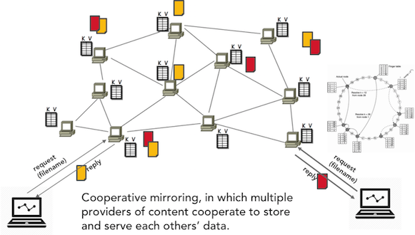
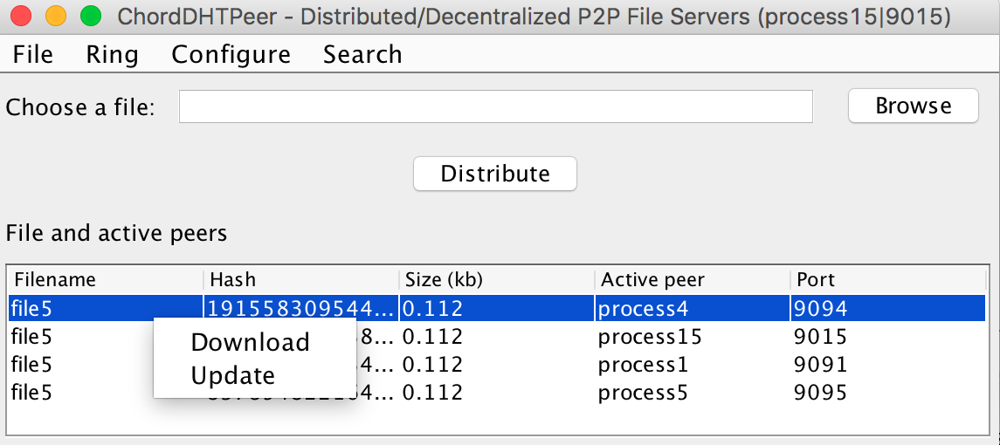
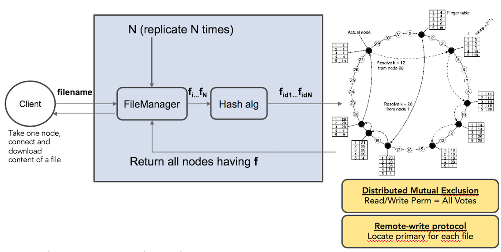
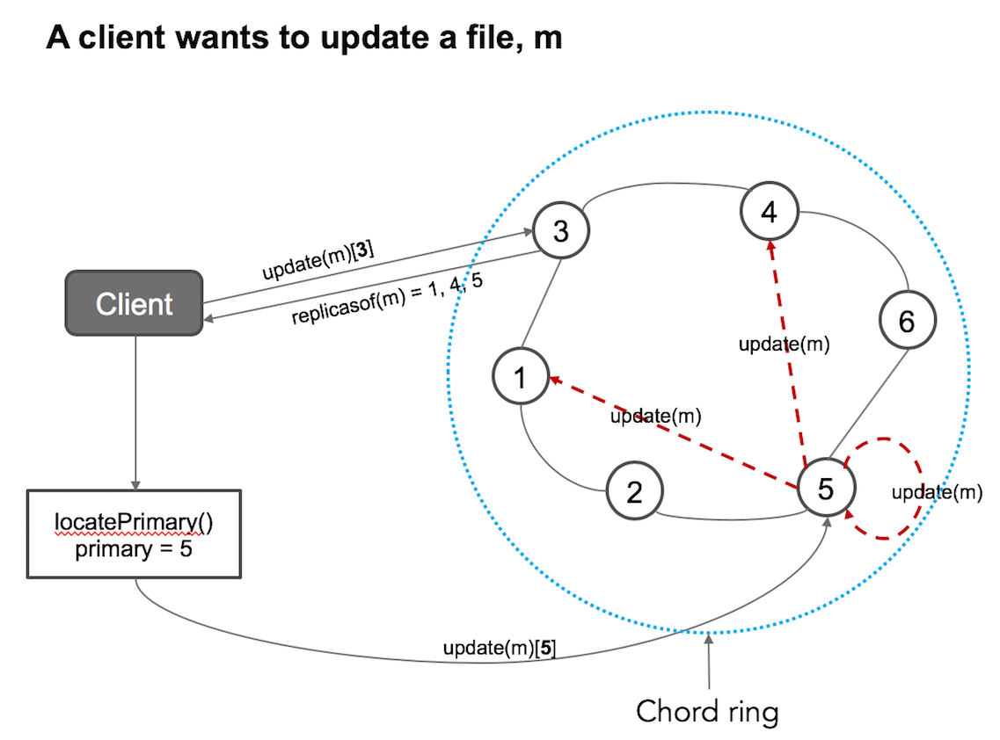
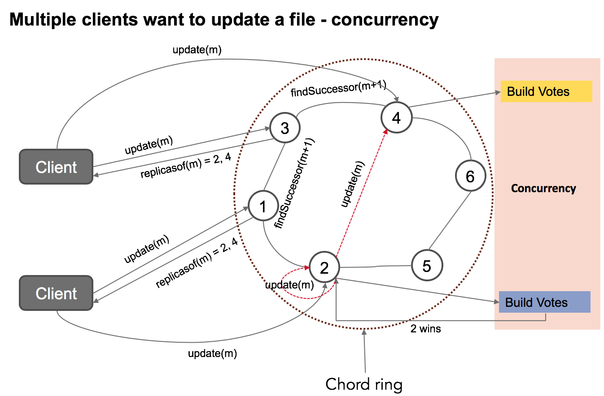
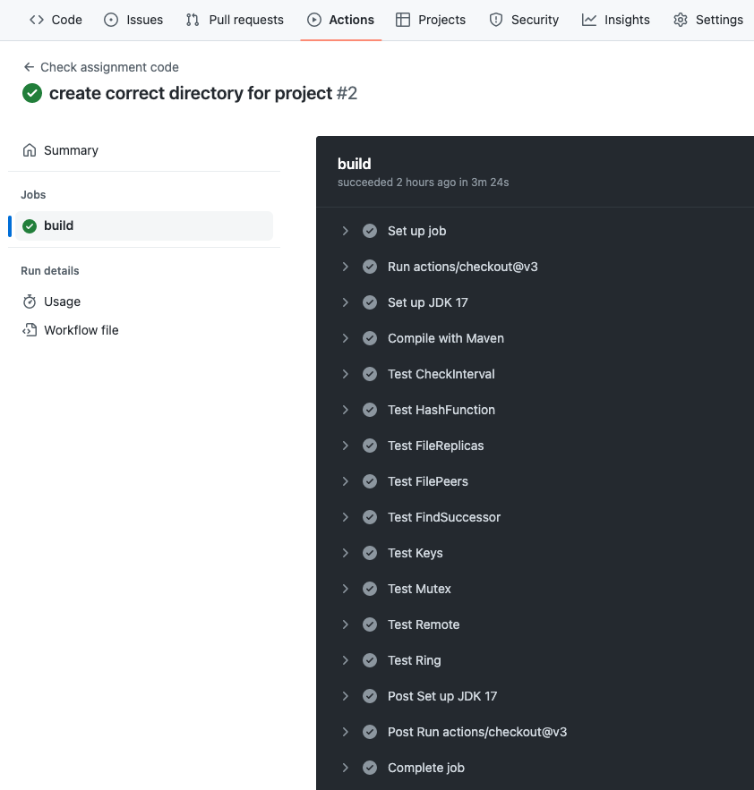

### Project 3 - Weeks 12 to 15: 18/03 - 14/04

### DHT Cooperative Mirroring with Consistency Protocol and Distributed Mutual Exclusion.

### Organisation

The project work is to be undertaken in groups of 2-4 students - preferably the same groups as for projects 1 & 2.

Discussions among the groups are allowed, but the code handed in by the group should be the work of the group members - and not members of other groups.

You are strongly encouraged to use the DAT110 Discord server throughout the project if you encounter issues or have questions related to the project.

The deadline for handing in the project can be found in Canvas.

### Getting Started - obtaining the start-code and the unit-test projects

#### Use-as-template and Clone the start-code repository

One member of the group should start by entering the following repository on github:

https://github.com/selabhvl/dat110-project3-dht-startcode

and choose '*Use this template*' (see button in the upper right of the repository web page).

This will create a "copy" of the start-code repository on the group members own github repository account.

In order for the other group members to work together on the same copy of the start-code, the other group members must be provided with access to read/write on the repository. See *Settings* and *Manage Access* for the repository.

All group members can now clone the repository and collaborate on the code.

The repository contains the start code organised into a [Maven](https://maven.apache.org/) project and can be imported into IDEs such as Eclipse and IntelliJ.

- Importing into Eclipse: Use `File -> Import -> Maven -> Existing Maven Projects` to import the startcode project
- Importing into IntelliJ: Use `File -> New -> Project From Existing Sources` to import the startcode project

The `src/main` folder contains the source code while the `src/test` folder contains a number of unit tests that can be used for some basic testing of the implemented functionality.

It should not be necessary to add additional classes in the start-code in order to complete the project. The unit-tests should not be modified as they will be used for evaluation of the submitted solution.

The code and tests can be compiled and run from the IDE or using maven commands with targets such as:

```
%>mvn compile
%>mvn test
```

It is also possible to execute the individual test classes by specifying the specific test-class to be executed. Below is an example of how to execute the tests in the `TestCheckInterval`-class.

```
%> mvn test -Dtest=TestCheckInterval 
```
### Overview

The project assumes that you have read and understood the following sections in the Distributed system book:
- Section 6.2.3 - Distributed hash tables (DHT) (Naming)
- Section 5.3.3 - Mutual Exclusion Distributed algorithm (Coordination)
- Section 7.5.1 - Remote-write & Replicated-write protocols (Consistency and Replication)

Therefore the project builds on exercise in week 6 - Chord Distributed Hash Table (https://github.com/selabhvl/dat110public/blob/master/week6/week6.md)

The implementation is based on synchronous communication by using the Java RMI remote procedure call (RPC)
The system works under these models and assumptions
- Our protocol uses strict, sequential consistency model and replicated write protocol. In addition, it uses a distributed mutual exclusion algorithm.
- We assume no message delay, loss or packet corruption during communications
- We assume that network is stable and there is no communication failure

A DHT can be used to build a cooperative mirroring peer-to-peer distributed system in which multiple providers of content cooperate to store and serve each others’ data.



#### Design
The idea behind cooperative mirroring is that a node can replicate its content among other nodes in the p2p system. In the DHT implementation, this replication is done dynamically where nodes can be assigned a file if the hash value (key) of a replica of this file maps to the hash value (id) of the node.

In this project, we can replicate a resource (e.g. a file) and distribute the replicas to running processes (peers) that are arranged in a ring topology. This design provides fault-tolerance and high availability for the resource.
However, to achieve these qualities require an efficient naming system. The DHT system provides the mechanism to pair a resource to the address where it can be stored and located.
Given a resource (e.g. a file), we can lookup the DHT system for the server(s) storing this file. The DHT system uses the same address space for naming a resource and its access point (peers).

The project is divided into six packages:

- no.hvl.dat110.chordoperations: contains the ChordProtocols, ChordLookup and StabilizationProtocols classes.

- no.hvl.dat110.rpc.interfaces: contains an interface (NodeInterface) with methods that peers can invoke remotely

- no.hvl.dat110.middleware: contains the class 'Node' which implements the remote methods. It also contains the NodeServer where the registry can be started and Node stub can be made available. The Message class is used to store the message we want to send among the nodes and to send back acknowledgements to the sender process. In addition, we can use it to specify the primary for a file. MutualExclusion, ChordLookup, and UpdateOperations classes are auxiliary classes for various operations performed by the Node class

- no.hvl.dat110.node.client: contains five processes which are instances of Node and have been pre-configured with nodenames and port numbers to form a ring. Process1 class must be started first, followed by other classes. 

- no.hvl.dat110.util: contains the Hash class for defining address space by using MD5 hash function and computing the identifier for an entity; the Util class provides method for getting a process stub and
checking if a key lies within a node/peer and its predecessor. (pred < key <= node). FileManager: contains methods for creating replicas of a file, distributing those replicas among active nodes in the chord ring, and looking up the active nodes responsible for a given file by iteratively resolving the replicaid (hash of replica) from an active node.

- no.hvl.dat110.main: Contains chord GUI that can be used to distribute file, lookup file, and update file. You join the ring by clicking "Ring" menu and Create/Join Ring. The GUI is meant to provide a graphical example of the file distribution and sharing functionalities. You do not need to implement anything here. When you have a complete solution, you may run the MainWindow.java and interact with the application.


The current implementation of the project allows the simulation of chord ring in a single machine environment but it can be simply modified to use multiple computers by using IP address for the nodename.


### Complete ChordDHT with Consistency protocol and Distributed Mutual Exclusion



### Tasks

The tasks are divided into 7 parts

#### Task 1 - Address space and size 

In this task, you will implement the methods hashOf(), addressSize() and bitSize() in the Hash class. You must use the MD5 hash algorithm because the unit test cases class are generated using MD5 hash.
MD5 compresses strings to 128bits, thus the address size will be 2^128 = 340282366920938463463374607431768211456.
Note that the peers (process1, process2, process3, process4, process5) have been given identifiers from the same address space. You will find this in the Node class: nodeID = Hash.hashOf(nodename);
 - Testing: 
   - IDE: Run the TestHashFunction 
   - Maven:  
 ```
 %> mvn test -Dtest=TestHashFunction
 ```
 
#### Task 2 - Creating Replicas of file using the address space (2^128)
This task requires that you replicate files using index from 0 to 3 (numReplicas = 4). You can simply use the Util.numReplicas for this purpose. That is, the index must be added to the filename to generate replicas. (e.g. for a file with name, "test", replicas will be:
test0, test1, test2, test3. Each replica will now be named using the hash function you have implemented in Task 1. Your task here is to implement this functionality in the createReplicaFiles() method in the FileManager class.
 - Testing: 
   - IDE: Run the TestFileReplicas
   - Maven:
  ```
  %> mvn test -Dtest=TestFileReplicas
  ```
 
#### Task 3 - Lookup logic, fingerTable and findSuccessor methods
The findSuccessor(id) method is a core method in the DHT system for recursively or iteratively resolving (looking up) a key from any node/peer. The first important task you must solve here before implementing the findsuccessor functions is to implement the logic to check the rule: lower <= id <= upper in the checkInterval() method in the Util class. For example, in mod 10, we check whether 9 lies between 6 and 2. It means id = 9, lower = 6 and upper = 2. (6, 2) in mod 10 = {6, 7, 8, 9, 0, 1, 2}. Your logic should return true. Further, we can check if id=6 lies between (6, 2). A correct implementation will return true. 
You may need to read pg. 333-336 of the DS book and the original paper on chord system. The paper is on Canvas. 
After you have successfully implemented the checkInterval logic, you can then implement the fixFingerTable method in the ChordProtocols and the findSuccessor method in the ChordLookup class. To correctly implement the findSuccessor function, you need to maintain a finger table for each node and also implement findHighestPredecessor method that uses the finger table to find the closest predecessor peer to a key. The three methods work hand-in-hand. For example, if fixFingerTable is incorrectly implemented, findSuccessor will be wrong and vice-versa. 
 - Testing:
   - IDE: Run the TestCheckInterval, TestFindSuccessor, and TestFingerTable
   - Maven:
 ```
 %> mvn test -Dtest=TestCheckInterval
 %> mvn test -Dtest=TestFindSuccessor,TestFingerTable
 ```
 
#### Task 4 - Distributing file replicas to peers
In the chord ring system, a peer has a predecessor and a successor. Identifiers (addresses) that are higher than the predecessor and lower or equal to the identifier of the peer are managed by the peer.
Our replica is thus distributed using the simple rule: pred < replica <= peer. If the replica's id is less than or equal to a peer's identifier and greater than the identifier of the peer's predecessor, we assign the replica to this peer.
You will be able to use the findSuccessor function you have implemented earlier for this purpose. To do this correctly, you will invoke node.findSuccessor(replica) for each replica.
Your task is to implement the distributeReplicastoPeers() in the FileManager class.
 - Testing:
   - IDE: Run the TestKeys 
   - Maven: 
 ```
 %> mvn test -Dtest=TestKeys
 ```

#### Task 5 - Finding the peers/servers responsible for a file
To look up a file in a chord system, we need to perform the same process in Task 4, where we replicate the file and find the peers holding each replica according to the rule. The system then returns the peers to the client.
The major task here is to implement the requestActiveNodesForFile() method in the FileManager. Given a filename, find all the peers that hold a copy of this file
 - Testing:
   - IDE: Run the TestFilePeers 
   - Maven:
 ```
 %> mvn test -Dtest=TestFilePeers
 ```

#### Task 6 - Remote-write protocol
The basic idea for remote write is that each file (data item) has a primary peer that is responsible for performing update and coordinating that other replicas perform the same update. Whenever a client wants to update a file, it has to locate the primary for this file and forward the update request to it. Therefore, only one process (peer) can perform update. The primary can then tell other peers holding a copy of this file to update.
This arrangement is illustrated in the figure below.

We will implement this replicated-write protocol (remote-write) on top of the chord. One way to do this, is to tag a replica as the primary item before we distribute to the ring. The primaryServer variable in the Message class can be used for this purpose.
We can then implement this logic in the distributeReplicastoPeers() in the FileManager class.
Subsequently, to locate the primary for a file, we need to first requestActiveNodesForFile(filename) and then iterate over the returned peers to find who holds the primary copy.
The task first, is to modify the distributeReplicastoPeers() to randomly assign a primary peer to a file replica.
Next, implement findPrimaryOfItem() that returns the primary node for this item (file).
A client request to a node to update a file using these implementations is illustrated in the unit test class (DHTTestRemote) where the client issues a request by invoking the requestRemoteWriteOperation() in the contacted node/peer.
 - Testing:
   - IDE: Run the TestRemote 
   - Maven: 
 ```
 %> mvn test -Dtest=TestRemote
 ```

#### Task 7 -  Distributed Mutual Exclusion Algorithm
The distributed mutual exclusion algorithm makes it possible to synchronize access to a critical section from concurrently running processes. In this scheme, multiple clients may attempt to update a single file by contacting different replicas (peers) as illustrated in the figure below.
Each contacted replica can then request a permission from the remaining replicas for this file for access to the critical section. The node that receives permission will update its local copy and tell the rest to update their local copies.
Your task is to implement the distributed mutual exclusion algorithm in the MutualExclusion class.

 - Testing:
   - IDE: Run the TestMutex
   - Maven:
  ```
  %> mvn test -Dtest=TestMutex
  ```

### Testing all testcases

 ```
 %> mvn test
 ```

### Handing in the project
1. When the group is ready to hand-in, a **tagged commit** must be pushed to github in order to trigger an action which compiles the solution and runs all test on github. This is done using the following git commands - where *X* is to be replaced by a number:

```
%> git tag handinX
%> git push origin handinX
```

If you, for some reasons, need to hand in again, then *X* will have to be a new number. **Note** it is no problem to push changes multiple times, but the github action is only triggered when you push a specific tag. You can go to your repository on github and check the result of executing the action by selecting the *Actions* tab as shown in the figure below.

2. The group must hand in a **link** on Canvas to the git-repository containing their implementation. **Remember** to hand-in as a group as described in the guide available on Canvas.

3. The group must provide **read access** to their solution repository to the lab-assistent. The usernames of the lab-assistants are available via Canvas.

